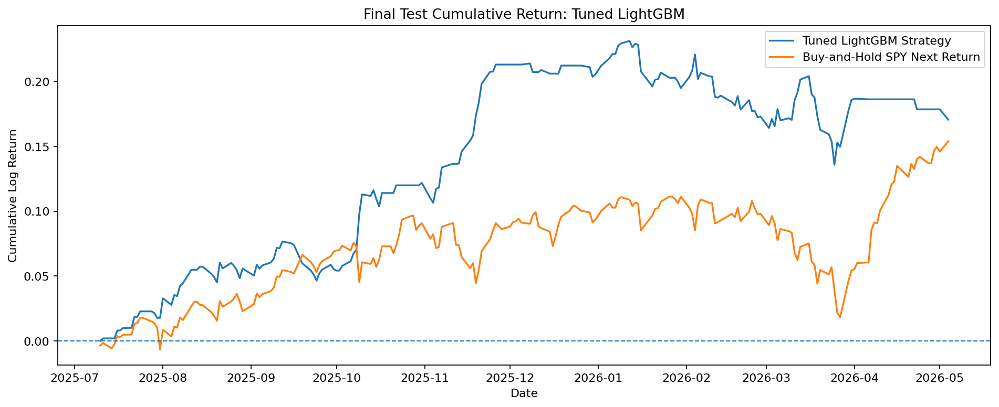
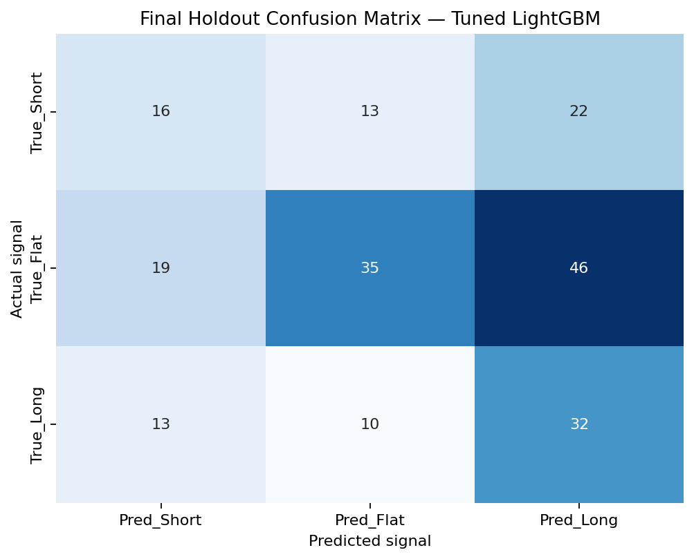
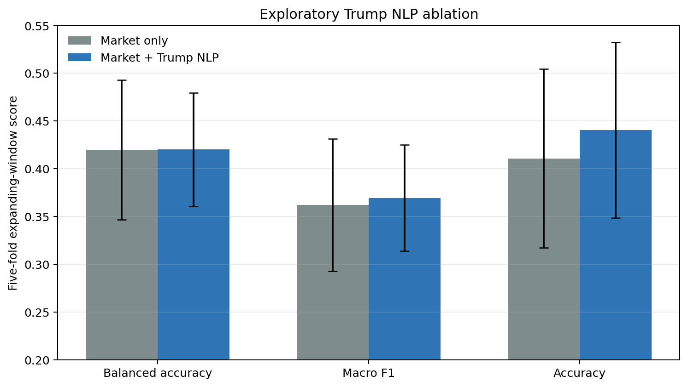

# SPY Next-Day Long/Flat/Short Signal Research

An end-to-end, leakage-aware machine-learning study of next-trading-day directional signals for SPY. The project converts information available at the current close into one of three actions:

- **Long:** sufficiently positive volatility-adjusted next-day return
- **Flat:** movement is too small to justify directional exposure
- **Short:** sufficiently negative volatility-adjusted next-day return

The emphasis is on a defensible research process: frozen inputs, chronological validation, train-only feature selection and tuning, explicit baselines, and one protected final-holdout evaluation. A separate exploratory module tests whether lagged topic features from archived Donald Trump Truth Social posts add information beyond the selected market features.

> Research prototype for educational purposes only. Results are historical, exclude trading costs, and are not investment advice.

## Research question

Can market, volatility, macroeconomic, and cross-market information available at day \(t\) support a robust Long/Flat/Short decision for SPY on trading day \(t+1\)?

Secondary extension: during the period covered by the public post archive, do prior-calendar-day Trump post activity and market-topic counts improve a controlled chronological baseline?

## Reproducibility first

Yahoo Finance can revise historical adjusted prices after dividends or other corporate actions. A runtime-only download therefore produced different model outputs even when the date range and row count were unchanged.

This repository now prevents that drift:

- `data/market_inputs_2026-05-05.csv` freezes the 1,088 pre-feature-engineering observations used by the published run.
- `data/market_inputs_2026-05-05.manifest.json` records provenance and the SHA-256 checksum.
- The notebook defaults to `REFRESH_DATA = False` and verifies the checksum before feature construction.
- A calendar gate requires exactly 1,027 complete NYSE modeling sessions from March 30, 2022 through May 4, 2026.
- The fast path uses single-process execution and fixed random seeds for reviewer-friendly behavior.
- `scripts/validate_repository.py` checks the snapshot, manifest, and notebook defaults without training the models.
- `data/nlp/manifest.json` freezes checksums and provenance for the derived Trump-post feature table and modeling table.
- The complete post corpus is not redistributed; collection and cleaning scripts write raw text only to ignored local paths.

The canonical snapshot SHA-256 is:

```text
d4625e4b58739080520150b5ecfeaf1e6967185f628bc6611129efecc4db4f5d
```

## Methodology

### Data and features

The frozen inputs combine adjusted SPY OHLCV data with VIX, DXY, the 10-year Treasury yield, crude oil, FRED 2-year and 10-year Treasury yields, and adjusted closes for QQQ, IWM, and DIA.

The initial 81 candidate features cover:

- lagged SPY returns, trend, momentum, and Bollinger position
- realized volatility and VIX level/change/regime
- Treasury yields and the 2Y-10Y yield curve
- DXY and crude-oil movements
- intraday range, overnight gap, and relative volume
- calendar effects
- cross-market signals from QQQ, IWM, and DIA

Feature selection is performed only on the training/CV period. Rolling 60-day Spearman IC and ICIR support within-group screening, followed by category-aware selection, hierarchical correlation clustering, and a final redundancy check. This reduces the feature set from **81 to 21**.

### Target

The target is the next-day SPY log return divided by 20-day historical volatility available at the current close. Short and Long thresholds are the 25th and 75th percentiles estimated from the training/CV sample only; the middle observations are labeled Flat.

### Validation design

- First 80%: training and model-selection period, 821 observations
- Final 20%: protected chronological holdout, 206 observations
- Five expanding-window validation folds with a one-trading-day gap
- Logistic Regression, Random Forest, XGBoost, and LightGBM compared with a majority-class baseline
- Balanced accuracy, Macro F1, fold stability, train-validation gaps, and trading diagnostics used together for model selection

### Exploratory Trump-post NLP extension

The extension uses an independent public archive of posts from Donald Trump's Truth Social account. The original collection contained 14,145 unique archive records from July 13, 2024 through April 23, 2026, of which 10,396 had usable text after encoding repair and cleaning. The committed inputs contain only derived features and a modeling table, not the post corpus.

Daily features include prior-day post count, total market-topic score, market-related post share, and topic scores for trade/tariffs, rates/Federal Reserve, inflation, geopolitics/China, energy/oil, economy/markets, legal/regulation, and election/policy. Every text feature is shifted by one calendar day before it is aligned to the market table. A standalone ablation then compares the same class-weighted Logistic Regression with the 21 selected market features versus market features plus the lagged text variables.

This module is intentionally separate from the canonical LightGBM selection. It uses five expanding-window folds with a one-session gap and a controlled final 20% holdout over the 446-session archive-coverage window.

## Canonical holdout results

The tuned LightGBM model was selected from walk-forward CV evidence and then evaluated once on the protected 206-day holdout. These numbers were regenerated from the committed snapshot with the validated software stack in `requirements.txt`.

| Metric | Final holdout |
|---|---:|
| Accuracy | 40.29% |
| Balanced accuracy | 41.52% |
| Macro F1 | 39.31% |
| Active-trade hit rate | 55.41% |
| Active-trade rate | 71.84% |
| Annualized return | 20.86% |
| Annualized volatility | 10.64% |
| Sharpe ratio | 1.96 |
| Maximum drawdown | -9.55% |

These figures are **before commissions, bid-ask spread, slippage, shorting costs, financing, and taxes**. The holdout covers only 206 sessions, and the model is sensitive to small changes in adjusted inputs. The trading metrics should therefore be treated as exploratory evidence, not as a deployable performance claim.



The confusion matrix makes the classification limitation visible: the model identifies some directional observations, but it frequently predicts Long for true Flat days.



## Exploratory NLP ablation results

The five expanding-window means show a small improvement in Macro F1 and accuracy, but almost no change in balanced accuracy. Fold dispersion overlaps substantially, so the result is not evidence of a stable incremental signal.

| Model | CV balanced accuracy | CV Macro F1 | CV accuracy |
|---|---:|---:|---:|
| Market only | 41.95% | 36.19% | 41.08% |
| Market + Trump NLP | 42.01% | 36.94% | 44.05% |

On the final 90-session chronological holdout within the archive-coverage period, the NLP specification performed better in this one split:

| Model | Holdout balanced accuracy | Holdout Macro F1 | Holdout accuracy |
|---|---:|---:|---:|
| Market only | 34.09% | 32.40% | 34.44% |
| Market + Trump NLP | 39.32% | 38.50% | 40.00% |



These figures are a sensitivity analysis, not a replacement for the canonical holdout. The period is short and politically specific, several frozen topic columns are constant zero, and the stronger final split is not sufficient to establish robustness or causality.

## Repository structure

```text
.
├── .github/workflows/validate.yml
├── assets/
│   ├── core_model_cv_metrics.png
│   ├── feature_importance_top15.png
│   ├── final_holdout_confusion_matrix.png
│   ├── final_holdout_cumulative_return.png
│   ├── final_signal_distribution.png
│   └── trump_nlp_cv_comparison.png
├── data/
│   ├── README.md
│   ├── nlp/
│   │   ├── README.md
│   │   ├── manifest.json
│   │   ├── trump_nlp_features_lag1.csv
│   │   └── trump_nlp_modeling_table.csv
│   ├── market_inputs_2026-05-05.csv
│   └── market_inputs_2026-05-05.manifest.json
├── notebooks/
│   └── spy_next_day_signal_research.ipynb
├── results/
│   ├── README.md
│   ├── final_test_confusion_matrix.csv
│   ├── final_test_metrics.csv
│   ├── run_manifest.json
│   ├── selected_features.csv
│   ├── trump_nlp_cv_metrics.csv
│   └── trump_nlp_holdout_metrics.csv
├── scripts/
│   ├── freeze_market_data.py
│   ├── nlp/
│   │   ├── clean_trump_archive.py
│   │   ├── evaluate_trump_nlp.py
│   │   └── scrape_trump_truth_archive.py
│   └── validate_repository.py
├── LICENSE
├── README.md
└── requirements.txt
```

The canonical notebook intentionally clears execution outputs to stay lightweight and reviewable. The committed result files preserve the validated output, and running the notebook regenerates all tables and figures.

## Run the project

Python 3.12 is the validated environment.

```bash
git clone https://github.com/yg3072-debug/spy-next-day-signal-research.git
cd spy-next-day-signal-research
python -m venv .venv

# macOS/Linux
source .venv/bin/activate

# Windows PowerShell
# .\.venv\Scripts\Activate.ps1

python -m pip install -r requirements.txt
python scripts/validate_repository.py
jupyter lab notebooks/spy_next_day_signal_research.ipynb
```

Run the notebook from top to bottom with the defaults:

```python
REFRESH_DATA = False
FULL_TUNING = False
```

The default analysis does not download market data because it reads the committed snapshot. Internet access is still needed to install dependencies.

Run the standalone Trump-post NLP ablation with:

```bash
python scripts/nlp/evaluate_trump_nlp.py
```

This command uses the committed derived tables and regenerates the NLP result CSVs and comparison figure. Raw post collection is optional and documented in `data/nlp/README.md`.

## Execution modes

### Fast reproduction — recommended

`FULL_TUNING = False` rebuilds the four tuned estimators from parameters selected during the original train-only walk-forward searches. It still reruns feature engineering, IC screening, diagnostics, model comparison, the protected holdout, and the figures.

### Full tuning

Set `FULL_TUNING = True` to repeat all four `GridSearchCV` searches. This entails 70,810 CV fits and can take several hours.

### Intentional data refresh

Set `REFRESH_DATA = True`, or run:

```bash
python scripts/freeze_market_data.py
```

This replaces the canonical snapshot and manifest. Because adjusted histories are mutable, a refresh is a **new research run**: rerun the notebook and update the README and result files together.

## Main limitations

- The sample covers a limited collection of recent market regimes.
- The holdout contains only 206 observations.
- Transaction costs, slippage, financing, borrow availability, and taxes are omitted.
- The current backtest maps discrete signals to fixed directional exposure and does not optimize position size.
- Feature screening includes a final manual redundancy decision.
- Classification performance remains modest, despite stronger trading-oriented metrics in this particular holdout.
- Tree predictions and trading metrics can be sensitive to small input or software-version changes.
- The canonical model does not use text features; the Trump-post NLP module is a separate short-window ablation.
- The raw post corpus is not redistributed, and the frozen topic table contains four zero-variance topic columns that the evaluator removes before fitting.
- The NLP coverage period is politically specific and too short to support a causal or deployable trading claim.
- Intraday microstructure data are not included.

## Planned research extension

The next stage will extend the framework to equity-index futures such as the E-mini S&P 500 and Nasdaq-100. That extension will require continuous-contract construction, rollover handling, nearly 24-hour session definitions, transaction-cost modeling, margin-aware position sizing, sequence models, dynamic decision policies, and explicit risk controls.

## License

Code is released under the MIT License. The frozen dataset retains the attribution and usage considerations described in `data/README.md`.
