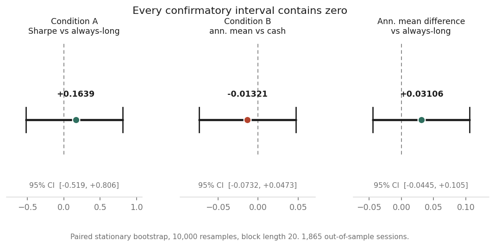
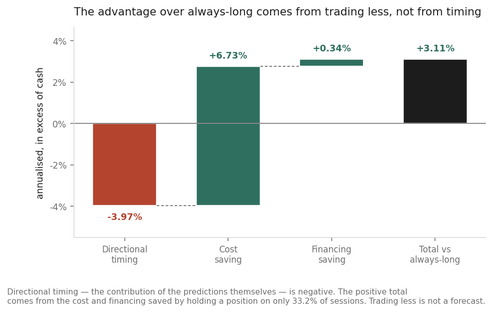
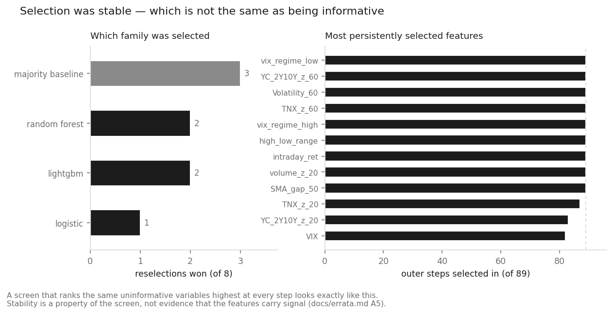

# Daily Directional Signals in SPY

[](https://github.com/yg3072-debug/spy-next-day-signal-research/actions/workflows/tests.yml)

A pre-registered study of whether next-day direction in SPY can be predicted well enough
to beat the obvious alternatives after costs. The protocol was frozen and hashed before
the confirmatory run, so the claim that the method was not tuned to the answer is
something a reader can check rather than take on trust.

**The answer is no.** That result is reported here in full.

---

## Research question

Can a daily-frequency model, using only information available at the close of session
*t*, produce a directional signal for session *t+1* that beats always-long and beats
cash — after realistic execution costs and financing?

"Beat" was defined in advance, as two conditions with pre-specified test statistics:

| | |
|---|---|
| **Condition A** | Sharpe ratio above always-long open-to-close |
| **Condition B** | annualised mean return above cash |

Both judged on a paired stationary bootstrap fixed before the run. Success here is not a
profitable strategy — it is a defensible conclusion. **"No support after costs" was
always the more likely outcome, and it is reported as such, without a second search.**

## What I built

- **81 candidate features** in 13 groups, each group a stated hypothesis rather than a
  bag of indicators — trend, volatility, intraday shape, volume, cross-market, macro,
  term structure, calendar
- **Nested walk-forward validation**: feature screening, hyperparameter search and
  probability calibration all happen *inside* each training fold, with an embargo
  between train and test
- **Per-step model selection** across logistic regression, random forest, LightGBM and
  XGBoost, with a one-standard-error rule and an explicit majority-class baseline that
  can win
- **Cost-aware position sizing**: a no-trade band derived from the round-trip cost and
  the financing rate, so the model must clear its own costs before it trades
- **Two execution specifications** — open-to-close as primary, close-to-close as a
  pre-registered exploratory arm, treated as different strategies and never mixed
- **Paired stationary bootstrap** inference (Politis–Romano) throughout, on the return
  differences rather than on the levels
- **An experiment registry** recording every trial ever run:
  **46 realised strategy paths across 36 families**, including the ones excluded from
  the trial budget and one that was voided, so the multiple-comparison surface is
  stated rather than implied
- **A pre-registered exploratory group** reported in full, including the specifications
  that beat the confirmatory result
- **A data-vintage sensitivity test** — the same window re-downloaded and compared field
  by field, because vendors revise adjusted history
- **NLP features** from two text sources, confined to the exploratory layer where they
  cannot touch the confirmatory conclusion
- **Automated tests and CI** covering temporal alignment, leakage controls, execution
  costs, calibration, output contracts, reproducibility checks and repository data
  governance

## Headline result

**Neither condition is met: insufficient evidence of a stable incremental value.**

Over 1,865 out-of-sample sessions (2019-03-21 to 2026-08-20), the Sharpe difference
against always-long is **+0.164**, interval **[−0.519, +0.806]**. The annualised mean
excess over cash is **−1.32%**, interval **[−7.32%, +4.73%]**. Every confirmatory
interval contains zero.



## Why the result matters

The strategy's mean return is **+3.11% above always-long**, which looks like a finding
until it is decomposed:

```
mean-return excess over always-long        annualised, paired intervals

    directional timing   −3.97%   [−11.51%, +3.58%]   ← the only term about prediction
    cost saving          +6.73%
    financing saving     +0.34%
    ─────────────────────────────────────────────────
    total                +3.11%   [ −4.45%, +10.55%]
```

**The entire positive point estimate comes from saving execution cost and financing.
The timing contribution — what the predictions themselves are worth — is negative.**
The model holds a position on 33% of sessions, and trading less is not a forecast.

Both intervals span zero, so neither number establishes anything in either direction.
The total is a difference of *mean returns*, a separate statistic from Condition A's
difference of *Sharpe ratios*, and it carries its own interval.



Two diagnostics computed without touching the P&L give no corroborating evidence of
skill: a Brier skill of +0.0122 against a training-base-rate reference, for which no
interval was pre-specified, and a regression slope of realised on predicted return of
−0.085 with an interval of [−1.005, +0.891] — far too wide to read as anti-prediction.
The verdict holds at block lengths 20, 10 and 5.

Selection was stable, which is a property of the screen rather than evidence about the
features:



The protocol fixed the wording for this case before the run: where a net excess is
significant but the positioning term is not, the available conclusion is that a
cost-aware participation filter beats forced daily trading, not that a signal was found.
Here even that is unavailable.

## Start here

| If you want | Read |
|---|---|
| A visual tour in ten minutes | [`notebooks/portfolio_walkthrough.ipynb`](notebooks/portfolio_walkthrough.ipynb) |
| The pre-registered method | [`docs/research_protocol.md`](docs/research_protocol.md) |
| The confirmatory result | [`reports/p1_confirmatory_result.md`](reports/p1_confirmatory_result.md) |
| The exploratory group, in full | [`reports/exploratory_results.md`](reports/exploratory_results.md) |
| The NLP layer | [`reports/alternative_data_appendix.md`](reports/alternative_data_appendix.md) |
| Why each choice was made | [`docs/decision_log.md`](docs/decision_log.md) |
| What was got wrong, and corrected | [`docs/errata.md`](docs/errata.md) |
| Which results file answers what | [`results/README.md`](results/README.md) |

```
src/          feature construction, pipeline, execution, position rule, bootstrap
scripts/      run, evaluate, freeze, verify
config/       p1.yaml (frozen, hashed) and the pre-registered exploratory overlays
data/         publishable inputs only — public-domain Treasury rates, session-level
              NLP aggregates, manifests. The market snapshot is NOT here; see below
results/      every prediction, selection log, diagnostic and summary
docs/         protocol, decision log, errata, feature dictionaries, data availability
reports/      the written findings, and the figures above
tests/        the automated checks, plus a synthetic market fixture
```

## Reproduction and data availability

**The market snapshot is not distributed with this repository.** The prices come from a
vendor whose terms do not permit redistribution. What is published is the filename, the
schema, the coverage, its SHA-256, the code that produced it, the code that verifies it,
and every result computed from it.

Without the snapshot you can run the full test suite, audit all of the code, review
every published result, and rebuild the financing fields from public Federal Reserve
Board H.15 data. You cannot reproduce P1 byte for byte — that needs the same bytes, and
only the vendor can supply them. A later download is a *new data vintage*, which the
study measures rather than glosses over (exploratory specification E21).

```bash
pip install -r requirements.txt        # exact pinned versions
pytest tests/ -q                       # runs without any vendor data
python scripts/verify_hashes.py        # frozen config and protocol digests
python scripts/verify_reproduction.py  # the primary run against the re-execution
```

Full detail, including the collection conduct for the text sources and how to obtain
each input legally, is in [`DATA_POLICY.md`](DATA_POLICY.md) and
[`docs/data_availability.md`](docs/data_availability.md).

## Limitations

- **No claim of stable tradable alpha.** This is a negative result about the strategy
  hypothesis, not a deployable trading system.
- **No pre-open information update.** Signals use the prior close only; a morning
  pipeline would see more, and the cost of that choice is quantified in the protocol.
- **No live order execution or slippage model based on proprietary fills.** Costs are a
  fixed per-side assumption plus financing, not a microstructure model.
- **Source text and vendor market data are not redistributed**, so the alternative-data
  layer and a byte-exact P1 re-run both require inputs you must obtain yourself.
- **One market, one horizon.** Nothing here speaks to other instruments or frequencies.

## Licence

[MIT](LICENSE), for this project's code only. It does not extend to the
Loughran–McDonald dictionary, the news headline dataset, Truth Social posts, or any
market data obtained through this code.
